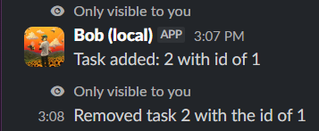
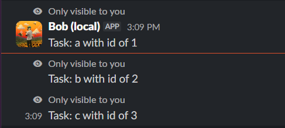
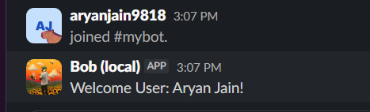

# Bob — Slack Task & Welcome Bot

Bob is a Slack bot built with [Bolt for Python](https://slack.dev/bolt-python/) that helps a channel manage a shared task list and automatically welcomes new members when they join.

## Features

- **`/make-task <description>`** — Add a new task to the shared list
- **`/all-tasks`** — List every open task with its ID
- **`/delete-task <id>`** — Remove a task by its ID
- **Automatic welcome message** — Posts a personalized greeting (using the new member's real name) whenever someone joins the channel
- **Persistent storage** — Tasks are saved to a local JSON file, so they survive bot restarts

## Screenshots

| Adding/Removing a task | Listing tasks | Welcome message |
|---|---|---|
|  |  |  |

## Running it locally

1. Install the [Slack CLI](https://api.slack.com/automation/cli/install)
2. Clone this repo and `cd` into the `week-8` folder
3. Create a virtual environment and install dependencies:
   ```
   python -m venv .venv
   .venv\Scripts\activate
   pip install -r requirements.txt
   ```
4. Run the bot and follow the prompts to install it to your own workspace:
   ```
   slack run
   ```

## Tech stack

- Python
- Slack Bolt for Python (Socket Mode)
- JSON file storage